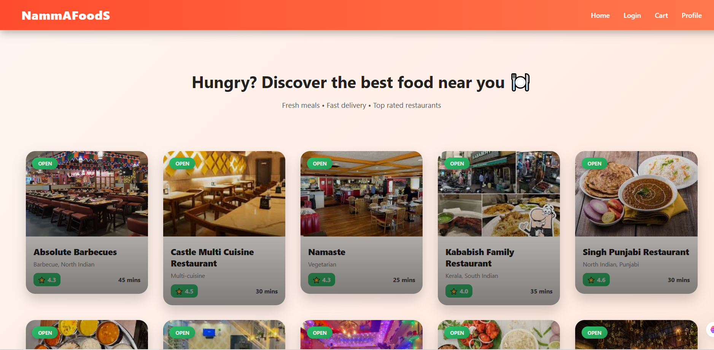
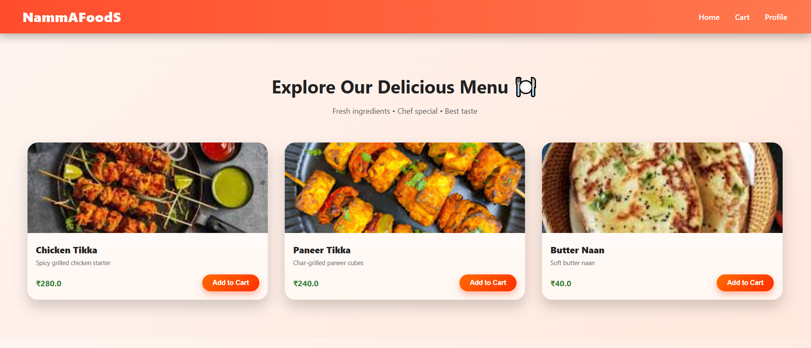
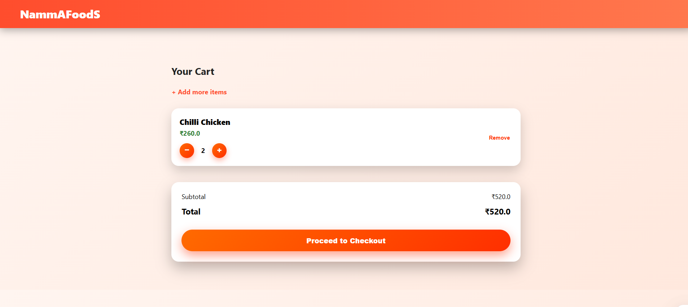
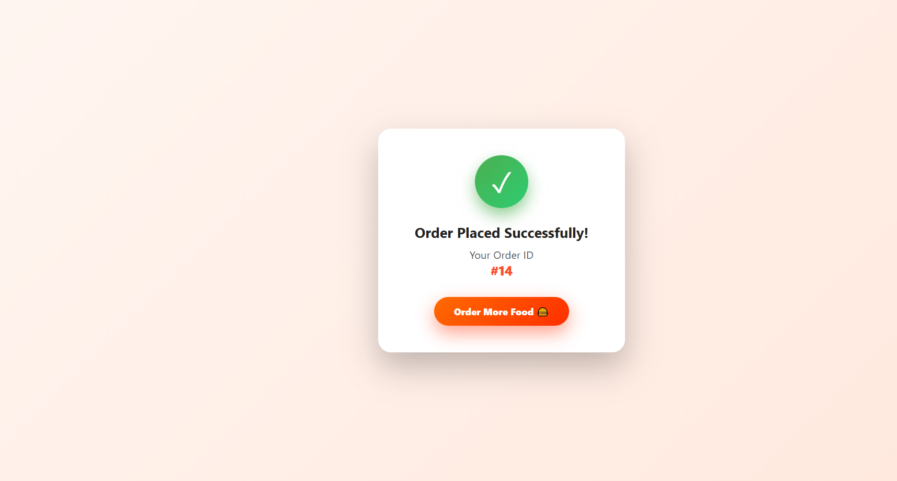

# 🍔 Food Delivery Web Application


🚀 A full-stack food delivery web application built using **Java Servlets, JSP, JDBC, and MySQL**.
This system allows users to browse menus, manage cart, and place orders — simulating real-world platforms like Swiggy/Zomato.

---

## 📸 Screenshots

### 🏠 Home Page



### 🍽️ Restaurant & Menu



### 🛒 Cart Page



### 📦 Order Page



---

## 🚀 Features

✔️ User Registration & Login Authentication
✔️ Browse Restaurants & Food Menu
✔️ Add to Cart / Update Quantity / Remove Items
✔️ Place Order Functionality
✔️ Order History Management
✔️ Session Tracking using Servlets
✔️ MVC Architecture Implementation

---

## 🛠️ Tech Stack

**Frontend:**

* HTML, CSS, JSP

**Backend:**

* Java Servlets, JDBC

**Database:**

* MySQL

**Server:**

* Apache Tomcat

**Build Tool:**

* Maven

---

## 📂 Project Architecture

The application follows the **MVC (Model-View-Controller)** pattern:

* **View →** JSP Pages
* **Controller →** Servlets
* **Model →** Java Classes & DAO Layer

---

## ▶️ How to Run

1️⃣ Clone the repository

```bash
git clone https://github.com/Techy-nithin/food-delivery-webapp.git
```

2️⃣ Import project into Eclipse / IntelliJ

3️⃣ Configure MySQL database

* Create database
* Update DB credentials in project

4️⃣ Deploy on Apache Tomcat Server

5️⃣ Open browser and access the application

---

## 📈 Future Enhancements

* 💳 Online Payment Integration
* 🔐 Advanced Authentication (JWT)
* 📍 Real-time Order Tracking
* 🧑‍💼 Admin Dashboard
* 🔍 Search & Filters

---

## 👨‍💻 Author

**Nithin G**
🔗 https://github.com/Techy-nithin

---

## ⭐ Support

If you like this project, give it a ⭐ on GitHub!
